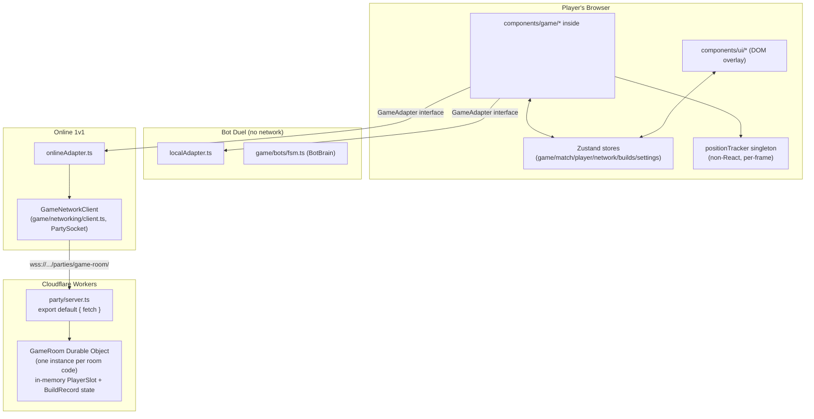
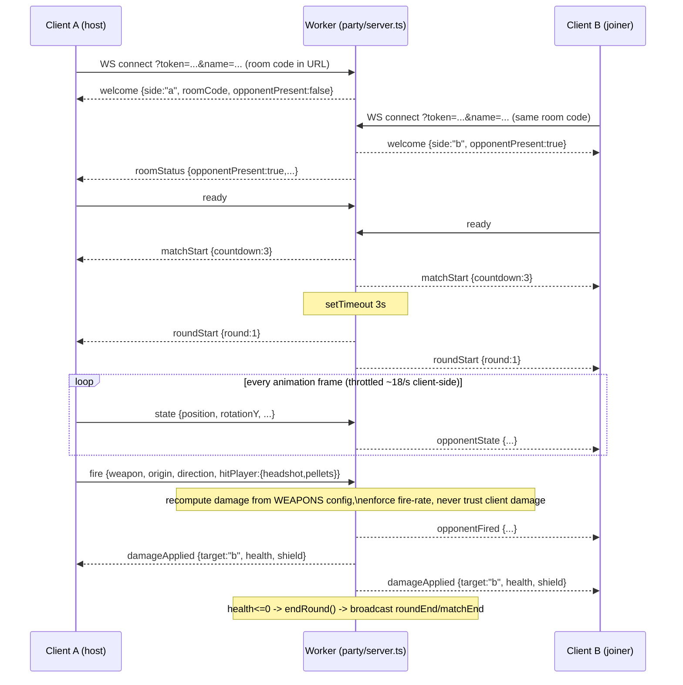

# ARCHITECTURE.md

Technical architecture reference for BuildStrike Arena. All file paths
verified against the repository as of 2026-08-06.

**Staleness note (2026-08-07):** written before the "Lobby Update" and
Battle Royale mode shipped (see `CHANGELOG.md` v0.2.0, `git log`) — this
document does not cover `game/br/` (Battle Royale), the Lobby hub
(`components/ui/Lobby.tsx`), cosmetics (`stores/inventoryStore.ts`), or
progression (`stores/profileStore.ts`). Not rewritten here to keep the
2026-08-07 doc-checkpoint pass scoped — see `PROJECT_STATE.md`.

## System overview

Two independent deployables share one repository:

1. **The game client** — a Next.js 16 App Router application. In
   practice a client-only single-page app: one route (`/`), no server
   rendering of gameplay content, no API routes, no middleware.
2. **The realtime backend** — a single Cloudflare Worker
   (`party/server.ts`) running one PartyServer `Server` subclass
   (`GameRoom`) per Durable Object instance, one instance per room code.
   Only used by Online 1v1; Bot Duel never talks to it.



## Frontend structure

- `app/layout.tsx` — root HTML shell, all `<head>` metadata (title,
  OpenGraph, Twitter card, viewport theme color). No providers, no
  context wrapping here.
- `app/page.tsx` — the entire app's routing. A single client component
  that switches between four "screens" based on `gameStore.screen`:
  `menu` → `<MainMenu/>`, `instructions` → `<InstructionsModal/>`,
  `settings` → `<SettingsPanel/>`, `playing` → `<GameCanvas/>` (loaded via
  `next/dynamic({ ssr: false })` since R3F/Rapier require a real DOM/WebGL
  context). Also owns one `useEffect` that pushes volume/mute settings
  into `soundManager` whenever they change.
- `components/game/GameCanvas.tsx` — the R3F entry point. Creates the
  `<Canvas>` (camera FOV/near/far from settings, DPR capped by graphics
  quality, antialiasing toggled off at "low" quality), wraps children in
  `<Physics>` (Rapier world, gravity `[0,-18,0]`, `timeStep="vary"`) and
  `<DamageableProvider>` (the hit-registration context), renders
  `<Arena>`, maps `useBuildsStore().builds` to `<BuildInstance>`, and
  conditionally mounts `<BotDuelScene>` or `<OnlineDuelScene>` based on
  `gameStore.mode`. Renders `<EffectsLayer>` as a Canvas sibling (still
  inside the R3F tree, outside `<Physics>` since effects don't need
  physics) and `<HUD>` as a DOM sibling *outside* the `<Canvas>` entirely.
- `components/game/BotDuelScene.tsx` / `components/game/OnlineDuelScene.tsx` — the two
  mode-specific orchestrators. Each owns match-flow side effects
  (countdown ticking for bot mode via `setInterval`; all server message
  handling for online mode) and renders exactly one `<LocalPlayer>` plus
  either one `<BotPlayer>` or one `<RemotePlayer>`.
- `components/ui/*` — pure DOM/Tailwind, no Three.js imports. Subscribe
  to Zustand stores reactively. `components/ui/HUD.tsx` is the top-level overlay
  orchestrator, composing `Crosshair`, `CombatHud`, `Scoreboard`,
  `PauseMenu` (when `gameStore.paused`), `MatchResults` (when
  `matchStore.phase === "match-end"`), `OnlineLobbyOverlay` (when in
  online mode and `!networkStore.matchStarted`), `ConnectionStatus`.

## Backend structure (party/server.ts)

One exported class, `GameRoom extends Server<Env>` (from `partyserver`,
which wraps a Cloudflare `DurableObject`). Cloudflare routes each
WebSocket connection to a specific Durable Object instance based on the
room code in the URL path (`/parties/game-room/<CODE>`), handled
automatically by `routePartykitRequest()` in the default `fetch` export.

State lives entirely as **in-memory JS class fields** on the `GameRoom`
instance: `slots: {a: PlayerSlot|null, b: PlayerSlot|null}`,
`builds: BuildRecord[]`, `score`, `round`, `phase`. **Not** persisted to
Durable Object storage/SQLite despite `wrangler.jsonc` declaring a SQLite
storage migration for the class (that migration exists because current
Cloudflare tooling requires *some* storage backing to be declared for
new Durable Object classes — the code itself never calls
`this.ctx.storage` or `this.sql`). This means: if the Durable Object is
evicted/restarted (Cloudflare hibernation, redeploy, or just enough idle
time), **all room state — score, health, builds, connections — is lost**.
Non-hibernating by default (no `static options = { hibernate: true }` is
set), so in practice a room stays warm as long as it has an active
connection.

### Request lifecycle (Online 1v1)



## Data flow

- **Local player → world:** `components/game/LocalPlayer.tsx`'s single `useFrame`
  callback reads pointer-lock mouse delta + keyboard/mouse-button refs
  every frame, computes movement via `useCharacterMover()` (wraps
  Rapier's `KinematicCharacterController`), updates the visual
  `THREE.Group` transform, writes its own position into
  `positionTracker.local` (a plain mutable singleton, not a Zustand
  store — read every frame by bot AI and, in online mode, unused since
  the opponent already has authoritative position from the network), and
  calls into whichever `GameAdapter` (`localAdapter` or `onlineAdapter`)
  was passed as a prop for anything that needs to leave the component
  (build placement, fire reports, heal reports, periodic state sync).
- **Bot → world:** `components/game/BotPlayer.tsx` runs the same character-mover pattern,
  driven by `BotBrain.update()` (pure function, `game/bots/fsm.ts`)
  instead of input. Reads the player's position from
  `positionTracker.local`. Applies damage to itself directly (bot mode
  has no server) and updates `playerStore.opponent` for the HUD.
- **Remote opponent → world:** `components/game/RemotePlayer.tsx` never runs physics —
  it exponentially damps (`THREE.MathUtils.damp`/`Vector3.lerp`) toward
  the latest `OpponentStateMsg` received over the network (interpolation
  for smooth remote movement), and writes into
  `positionTracker.opponent`.
- **Hit detection (both modes):** `game/physics/damageable.tsx`'s
  `DamageableProvider` is a React Context holding a `Map<id, DamageableEntry>`
  (mutated via refs, not React state, so registration doesn't cause
  re-renders). Every damageable thing (local player's own hitbox — bot
  mode only, the bot, the remote-player hitbox, every placed build)
  registers an entry with a `THREE.Object3D` target and a `takeDamage`
  callback. `game/weapons/hitscan.ts`'s `fireWeapon()` raycasts against
  `registry.all()` using `THREE.Raycaster`, groups hits by entry, and the
  caller (`LocalPlayer`/`BotPlayer`) decides how to apply damage:
  **directly** in bot mode, or **via `adapter.reportFire()`** (network
  message) in online mode, where the *server* — not this client-side
  raycast — is the actual authority on health.
- **Builds:** `stores/buildsStore.ts` is the single shared list rendered
  by `components/game/GameCanvas.tsx` regardless of source (local placement, bot
  placement, or a `buildConfirmed` network message). Placement validation
  (`game/building/grid.ts`'s `validatePlacement()`) is a pure function
  with no side effects, called **both** client-side (for the placement
  preview/ghost) and server-side (`party/server.ts`'s
  `handleBuildPlace()`, the actual authority in online mode).

## Server/client boundaries

There is no Next.js server logic in this project — no API routes, no
Server Actions, no middleware, no server components with data fetching.
The only real "server" is the separately-deployed Worker. Treat
`party/server.ts` as a distinct backend service reachable only over
WebSocket, not as part of the Next.js request/response cycle.

## Rendering strategy

Fully client-rendered. `next build` statically prerenders the shell (`/`,
`/_not-found`, `/icon.svg`) since there's no dynamic server data — but
all actual gameplay UI mounts client-side after hydration, and the R3F
canvas is explicitly excluded from SSR via `next/dynamic({ ssr: false })`.

## State management

See `CLAUDE.md` → Coding conventions for the ref-vs-Zustand split
philosophy. Store responsibilities:

| Store | Owns | Persisted? |
|---|---|---|
| `gameStore` | current screen, mode (`"bot"\|"online"\|null`), paused flag, "has seen controls" flag | No |
| `matchStore` | round/score/phase state machine (`countdown→combat→round-end→match-end`), `resetSignal` (bumped to trigger player respawn-to-spawn-point effects) | No |
| `playerStore` | local player's full HUD state (health/shield/ammo/selected item/build mode/heal progress/etc.) + opponent's health/shield/connected for HUD display + one-shot trigger timestamps (hit marker, damage flash) | No |
| `networkStore` | connection status, room code, side (`a`/`b`), ready flags, ping, error message | No |
| `buildsStore` | flat list of all placed builds (any owner) | No |
| `settingsStore` | sensitivity, volume, graphics quality, shadows, FOV, crosshair, bot difficulty, FPS counter toggle, mute | **Yes** — `zustand/middleware persist`, localStorage key `buildstrike-settings` |

## Authentication flow

None exists. See `CLAUDE.md`.

## Authorization flow

Room-membership only (max 2 connections per Durable Object, matched by
`sessionStorage` token for reconnection). No user-level authorization
concept exists.

## Database access flow

N/A — no database. See `DATABASE.md`.

## Storage flow

- **Client:** `localStorage` for settings only (via zustand persist).
  `sessionStorage` for the per-room reconnection token (keyed
  `buildstrike-token-<ROOMCODE>`, one 16-char nanoid per room per tab).
- **Server:** In-memory only (see Backend structure above). Durable
  Object storage/SQLite is declared in `wrangler.jsonc` but never used.

## External API/integration flow

None. See `CLAUDE.md` → API and integrations.

## Real-time communication / multiplayer architecture

Single WebSocket per client, one Durable Object per room, JSON text
frames both directions (`JSON.stringify`/`JSON.parse`, no binary
framing). Full message catalogue in `API_REFERENCE.md`. Client library:
`partysocket`'s `PartySocket` (extends `ReconnectingWebSocket` — handles
automatic reconnection at the transport level; `GameNetworkClient`
(`game/networking/client.ts`) wraps it with a typed `send`/`onMessage`
API and a 3-second ping interval for RTT measurement).

## Background/scheduled jobs

None. The only `setTimeout`/`setInterval` usage is in-process, short-lived
UI/game-flow timers (countdown ticking, round-end delay, disconnect grace
period) — not a job queue or scheduler of any kind.

## Caching

None beyond the browser's default HTTP caching of static assets and
Next.js's default build-time asset optimization. No explicit cache
headers, no CDN configuration, no data caching layer (there's no data to
cache).

## Error handling

- **Client:** Mostly implicit — no error boundaries found in the
  component tree, no global error handler beyond what Next.js provides by
  default (`app/_not-found`). `GameNetworkClient`'s incoming-message
  parser wraps `JSON.parse` in try/catch and silently drops malformed
  frames.
- **Server:** `party/server.ts`'s `onMessage` also wraps `JSON.parse` in
  try/catch (drops malformed frames). `onError` simply delegates to
  `onClose`. No structured error reporting/logging exists.

## Logging

None beyond default `console` output from the frameworks themselves
(Next.js dev server, Wrangler dev). No application-level logging,
structured or otherwise, was added.

## Deployment architecture

See `DEPLOYMENT.md`. Two independent deploy targets, connected only by
the `NEXT_PUBLIC_PARTY_HOST` env var:

```mermaid
flowchart LR
    Dev["Developer"] -- "git push (not yet set up)" --> Vercel["Vercel\n(Next.js app)\nNOT YET DEPLOYED"]
    Dev -- "npm run party:deploy" --> CFWorkers["Cloudflare Workers\n(party/server.ts)\nNOT YET DEPLOYED"]
    Vercel -- "NEXT_PUBLIC_PARTY_HOST env var\n(build-time, client-bundled)" -.-> CFWorkers
    Browser["Player browser"] -- "HTTPS" --> Vercel
    Browser -- "WSS" --> CFWorkers
```

## Scaling considerations

Not evaluated/tested. Each room is one Durable Object (Cloudflare's model
scales rooms horizontally by design), but the in-memory-only state means
a Durable Object restart mid-match loses that match entirely — this is
the main scaling/reliability risk, not connection count.

## Security boundaries

Full detail in `SECURITY.md`. Summary: the server is authoritative for
health/score/build-placement/fire-rate; it is *not* authoritative for hit
*detection* (each client's own raycast decides whether a shot "hit" —
the server only validates the resulting damage/rate, it doesn't
re-simulate the 3D scene). This is a documented, deliberate trade-off,
not an oversight — but it means a modified client could falsely claim
hits it didn't actually land (bounded by fire-rate limiting, not
eliminated).

## Major architectural risks

1. **In-memory-only multiplayer state** (no persistence) — a Durable
   Object restart mid-match is unrecoverable; players would need to
   create a new room.
2. **No version negotiation on the wire protocol** — deploying a client
   and Worker with mismatched `game/networking/types.ts` shapes fails
   silently (messages either get dropped by the `JSON.parse` catch or
   produce `undefined` fields with no runtime schema validation).
3. **Client-side hit detection trust boundary** — see Security boundaries
   above and `SECURITY.md`.
4. **Untested at scale/under real network conditions** — the movement
   speed-validation tolerance (`MAX_SPEED` in `party/server.ts`) and the
   55ms client state-send throttle (`components/game/LocalPlayer.tsx`) were chosen by
   inspection, not measured against real-world latency/jitter.
