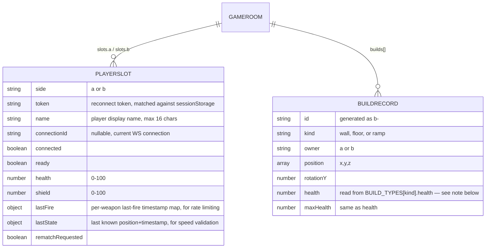

# DATABASE.md

## There is no database

Verified by repository-wide search: no ORM (Prisma/Drizzle/TypeORM/etc.),
no SQL/NoSQL client library in `package.json`, no schema files, no
migration files, no seed files, no `DATABASE_URL`-shaped environment
variable, no `db/` or `prisma/` or `supabase/` directory. This is a
deliberate consequence of the product having no accounts and no
persistent data (see `DECISIONS.md` D-001).

This file instead documents **where state actually lives**, since a
future agent reading "DATABASE.md" should not conclude "nothing to know
here" — there are real data shapes and real data-loss risks, just no
database.

## Storage provider

None. See `CLAUDE.md`.

## Where state actually lives

### 1. Client-side persisted state — `localStorage`

Only settings persist across sessions.

- **Mechanism:** `zustand/middleware`'s `persist`, in
  `stores/settingsStore.ts`.
- **Key:** `buildstrike-settings`
- **Shape:** `{ mouseSensitivity, masterVolume, sfxVolume,
  graphicsQuality, shadowsEnabled, fov, crosshairSize, crosshairOpacity,
  botDifficulty, showFps, muted }` — see `SettingsState` in
  `stores/settingsStore.ts` for exact types/defaults.
- **Sensitive data:** None.
- **Retention:** Forever, until the user clears site data or clicks
  "Reset to Defaults" in `SettingsPanel.tsx`.

### 2. Client-side session state — `sessionStorage`

- **Mechanism:** Direct `sessionStorage.getItem`/`setItem` in
  `game/networking/client.ts`.
- **Key pattern:** `buildstrike-token-<ROOMCODE>`
- **Value:** A 16-character nanoid, generated once per room per browser
  tab, reused on reconnect so the server can match the client back to its
  existing `PlayerSlot` (see below) within the 25-second grace window.
- **Retention:** Until the tab closes (sessionStorage semantics).

### 3. Client-side in-memory state — Zustand stores

Everything else the UI needs reactively. Reset on page reload; never
persisted. Full list and ownership in `ARCHITECTURE.md` → State
management table (`gameStore`, `matchStore`, `playerStore`,
`networkStore`, `buildsStore`).

### 4. Server-side in-memory state — the `GameRoom` Durable Object

This is the closest thing this project has to "the database," and it is
explicitly **not persisted**. One `GameRoom` instance (from `party/server.ts`)
exists per room code, holding these class fields:

```ts
class GameRoom {
  slots: Record<"a" | "b", PlayerSlot | null>;
  builds: BuildRecord[];
  score: Record<"a" | "b", number>;
  round: number;
  phase: "lobby" | "countdown" | "combat" | "round-end" | "match-end";
}
```



**Note on `BuildRecord.health`/`maxHealth`:** previously hardcoded as a
literal `150` in `party/server.ts`'s `handleBuildPlace()`; fixed
2026-08-06 (`BUG-005`, `TASKS.md` `T-005b`) to read
`BUILD_TYPES[msg.kind].health` from `game/config/builds.ts` instead —
verified live via a raw WebSocket script that confirmed `buildConfirmed`
returns the correct config-sourced value.

- **Primary "key":** Room code (Durable Object instance name), a
  5-character string from `ROOM_CODE_ALPHABET` (`game/networking/types.ts`
  — excludes ambiguous characters `0/O/1/I` etc.), generated client-side.
- **Relationships:** `PlayerSlot.side` is the foreign-key-like link to
  `BuildRecord.owner`/`score`/`slots` keys — all keyed by the same
  `"a"|"b"` union, not a generated ID.
- **Indexes:** None — this is plain JS objects/arrays in memory, not a
  queryable store. Lookups are `Array.find`/object-key access.
- **Constraints:** Enforced in application code, not by a schema:
  max 2 slots (room-full rejection in `onConnect`), max
  `BUILD_CONFIG.maxActivePerPlayer` (12) active builds per owner
  (`validatePlacement` in `game/building/grid.ts`).
- **Row-level security / access patterns:** N/A — no query layer exists;
  every connection to a given Durable Object instance can only ever see
  that instance's own room (Cloudflare's Durable Object routing model
  provides this isolation, not application-level RLS).
- **Ownership model:** A `PlayerSlot` is "owned" by whichever WebSocket
  connection currently holds a matching `token`. Not user-account
  ownership — just a soft session-affinity mechanism for reconnection.
- **Deletion/retention behavior:** A slot is cleared
  (`this.slots[side] = null`) 25 seconds after disconnect if no
  reconnect happens (`RECONNECT_GRACE_MS` in `party/server.ts`). The
  entire `GameRoom` instance (and everything in it) disappears whenever
  Cloudflare evicts the Durable Object (idle timeout, redeploy, or a
  crash) — **there is no way to recover a room's state after that.**
- **Generated types:** None — no `wrangler types` step exists in any
  npm script; `@cloudflare/workers-types` provides ambient global types
  (`DurableObjectNamespace`, etc.) but nothing project-specific is
  code-generated.

## Storage buckets

None. No file/blob storage of any kind (no images, no user uploads).

## Sensitive data

None stored anywhere, client or server. The closest things to
"identifying" data are the player's chosen display name (max 16 chars,
never validated for content, visible only to their one opponent for the
duration of a single match) and the ephemeral reconnect token — neither
is a credential, neither is retained beyond the room's lifetime.

## Migration risks

None apply — there is no schema to migrate. If persistent storage is
ever added to the Durable Object (see `ROADMAP.md` → Post-MVP), note
that `wrangler.jsonc` already has a `migrations` array with one entry
(`tag: "v1", new_sqlite_classes: ["GameRoom"]`) — any *future* schema
change to actual persisted data would need a new migration tag, and
Cloudflare will reject reusing/editing an already-deployed migration
entry. Nothing has been deployed yet as of this audit, so this is
currently a non-issue, but will become load-bearing the moment
`party:deploy` is run for the first time — see `CLAUDE.md`'s "DO NOT
CHANGE WITHOUT REVIEW."

## Known inconsistencies

None currently. (`BuildRecord.health`/`maxHealth` was hardcoded
server-side instead of read from config — fixed 2026-08-06, see note
above.)
